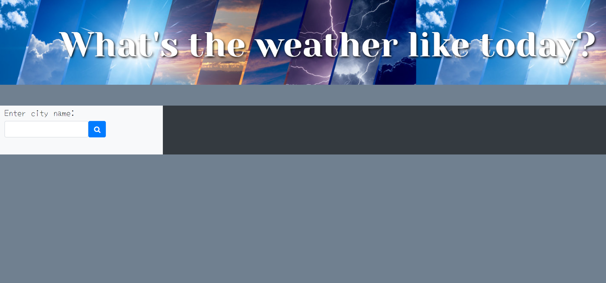

# The-Best-Weather-app
This is the only weather app you will ever need. 
## Description 
This is a tiny weather app that allows the user to enter the name of a city, and then retrieve information on the weather for the current day, and for the next few days.
When the user enters the name of the city within the search field, they should get the temperature, humidity, and other values concerning the conditions of the day.
Once they search for one city, the search field should be cleared, and they can put in another city they want to get information on.
All the cities the user searches will be stored in the local storage, and on a list of previous searches will be displayed, so that the user can view the weather conditions again without having to do another search.
This is how this app is meant to work, however, at this stage there are still many components missing, that need to be refined and reworked.

Here is the link to the app: (https://pnambao.github.io/Work-day-Scheduler-App/)

This is an example image of the page: 

## Credits
Chris Woolcott (https://github.com/cwoolcott)
Nate Perfettiful (https://github.com/perfettiful)
Philip Merriman (https://github.com/phillipmerriman)
​
## License
​Copyright (c) [2021] [PanjeNambao]

Permission is hereby granted, free of charge, to any person obtaining a copy
of this software and associated documentation files (the "Software"), to deal
in the Software without restriction, including without limitation the rights
to use, copy, modify, merge, publish, distribute, sublicense, and/or sell
copies of the Software, and to permit persons to whom the Software is
furnished to do so, subject to the following conditions:

The above copyright notice and this permission notice shall be included in all
copies or substantial portions of the Software.

THE SOFTWARE IS PROVIDED "AS IS", WITHOUT WARRANTY OF ANY KIND, EXPRESS OR
IMPLIED, INCLUDING BUT NOT LIMITED TO THE WARRANTIES OF MERCHANTABILITY,
FITNESS FOR A PARTICULAR PURPOSE AND NONINFRINGEMENT. IN NO EVENT SHALL THE
AUTHORS OR COPYRIGHT HOLDERS BE LIABLE FOR ANY CLAIM, DAMAGES OR OTHER
LIABILITY, WHETHER IN AN ACTION OF CONTRACT, TORT OR OTHERWISE, ARISING FROM,
OUT OF OR IN CONNECTION WITH THE SOFTWARE OR THE USE OR OTHER DEALINGS IN THE
SOFTWARE.
